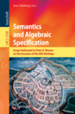

# Peter D Mosses

> BA, MSc, DPhil ([Oxford University](http://www.ox.ac.uk/))
>
> [Professor Emeritus](http://www.swansea.ac.uk/staff/science/computer-science/p.d.mosses/), [Computer Science](http://www.swansea.ac.uk/compsci/), [Swansea University](http://www.swansea.ac.uk/), UK
>
> [Visitor](https://www.tudelft.nl/en/staff/p.d.mosses/), [Programming Languages Group](https://pl.ewi.tudelft.nl), [Software Technology](https://www.tudelft.nl/en/eemcs/the-faculty/departments/software-technology/), [TU Delft](https://www.tudelft.nl/en/), The Netherlands

The focus of my current research is further development of the component-based approach to semantics of programming languages, established by the **[PLanCompS](http://www.plancomps.org/)** project, together with tool support and major case studies.

My [old personal home page](http://cs.swansea.ac.uk/~cspdm/) at Swansea University is no longer updated, and will be removed. All items of potential current interest have been copied to this new home page; most of the other items have been copied to the [archives](archives.md) page.

## Publications

[ORCID](https://orcid.org/0000-0002-5826-7520) • [Google Scholar](https://scholar.google.co.uk/citations?user=fIK8JS8AAAAJ) • [Researchr](https://researchr.org/profile/peterdmosses) • [ResearchGate](http://www.researchgate.net/profile/Peter_Mosses) • [DBLP](https://dblp.org/pid/m/PeterDMosses) • [AMiner](http://aminer.org/profile/53f439bbdabfaeee229c9f29) • [Scopus](https://www.scopus.com/authid/detail.uri?authorId=6701810942) • [GitHub](https://github.com/pdmosses)

### Highlights

- **[CBS](https://plancomps.github.io/CBS-beta/)**: a framework for component-based specification of programming languages (beta-release)

  - [*Funcons-beta*](https://plancomps.github.io/CBS-beta/docs/Funcons-beta): an initial library of 'funcons' (fundamental programming constructs)
  - [*Languages-beta*](https://plancomps.github.io/CBS-beta/docs/Languages-beta): several illustrative languages specified by translation to funcons

- **Software meta-language engineering and CBS:** *[Journal of Computer Languages](https://doi.org/10.1016/j.jvlc.2018.11.003)* (2019)

- **Executable component-based semantics,** with [Thomas van Binsbergen](https://pure.royalholloway.ac.uk/portal/en/persons/thomas-van-binsbergen(bf15f269-6564-44e7-a089-3495c671caf6).html) and [Neil Sculthorpe](http://neilsculthorpe.com): *[JLAMP](https://doi.org/10.1016/j.jlamp.2018.12.004)* (2019), *[preprint](papers/Binsbergen2019ECBS/preprint.pdf)* (PDF)

- **SIS – Semantics Implementation System** (1979): *[Reference Manual](http://cs.swansea.ac.uk/~cspdm/pub/DAIMI-MD-30.pdf)* (PDF), *[Tested Examples](http://cs.swansea.ac.uk/~cspdm/pub/DAIMI-MD-33.pdf)* (PDF), copied from the *[Semantics Library](http://homepages.cs.ncl.ac.uk/cliff.jones/semantics-library/)* of [Cliff B Jones](http://homepages.cs.ncl.ac.uk/cliff.jones/)

- **Festschrift:** [*Semantics and Algebraic Specification*](http://www.springer.com/computer/foundations/book/978-3-642-04163-1), edited by [Jens Palsberg](http://www.cs.ucla.edu/~palsberg/), with contributions by many international colleagues and former students, published by Springer as  [LNCS 5700](http://www.springer.com/computer/foundations/book/978-3-642-04163-1):

  > 

## Meetings

Recent and forthcoming meetings in which I'm involved:

- [Lovelace lecture 2019](https://www.bcs.org/content/ConWebDoc/60513) by [Gordon Plotkin](https://en.wikipedia.org/wiki/Gordon_Plotkin): *Languages for learning*, London, UK, 4 March 2019
- [LangDev'19](http://langdevcon.org/): *an informal meeting on language development using language workbenches*, Amsterdam, The Netherlands, 21–22 March 2019 (presentation: *Reuse and co-evolution in CBS language specifications*, slides [PDF](https://pdmosses.github.io/meetings/LangDev-2019/LangDev-2019-slides.pdf))
- [FSEN 2019](http://fsen.ir/2019/): *8th IPM International Conference on Fundamentals of Software Engineering*, Tehran, Iran, 1–3 May 2019 (PC member)
- [PSI'19](http://psi.nsc.ru): *12th A.P. Ershov Informatics Conference*, Akademgorodok, Novosibirsk, Russia, 2–5 July 2019  (PC member)
- [SBLP 2019](http://cbsoft2019.ufba.br/sblp.html): *XXIII Brazilian Symposium on Programming Languages*, Universidade Federal da Bahia – UFBA, Salvador, Brazil, 23–27 September 2019 (PC member)
- [HFM 2019](https://sites.google.com/view/hfm2019/): *History of Formal Methods Workshop*, Porto, Portugal, 11 October 2019 (PC member)
- [GPCE 2019](https://conf.researchr.org/home/gpce-2019): *18th International Conference on Generative Programming: Concepts & Experiences*, Athens, Greece, 21–22 October 2019 (PC member)

## Current affiliations

- **[Swansea University](http://www.swansea.ac.uk/):** Department of [Computer Science](http://www.swansea.ac.uk/compsci/)  
  (professor 2005–2015, emeritus since 2016)
- **[TU Delft](https://www.tudelft.nl/en/):** Research group on [Programming Languages](https://pl.ewi.tudelft.nl)  
  (visitor since 2016)
- **[WG 1.3](http://ifipwg13.informatik.uni-bremen.de/):** IFIP Working Group on Foundations of System Specification  
  (member 1994–2015, chair 1998–2003, emeritus member since 2015)
- **[WG 2.2](http://wg22.labri.fr/):** IFIP Working Group on Formal Description of Programming Concepts  
  (member since 1984)
- **[WG 2.11](https://wiki.hh.se/wg211/):** IFIP Working Group on Program Generation  
  (member since 2013)
- **[LinkedIn](https://www.linkedin.com/in/pdmosses/)**
- **[conf.researchr.org](https://conf.researchr.org/profile/peterdmosses)**

## Resources

- [Spoofax](https://www.metaborg.org/en/latest/) language workbench
- [GitHub](https://github.com): [Pages](https://pages.github.com), [Desktop](https://desktop.github.com) repository and website management
- [Atom](https://atom.io) text editor
- [Typora](https://typora.io) Markdown editor
- [Overleaf](https://www.overleaf.com?r=fd800312&rm=d&rs=b) collaborative *LaTeX* editor
- [Identify the Champion](http://www.iam.unibe.ch/~oscar/Champion/) organisational pattern language for programme committees
- [Computer Science for Fun!](http://www.cs4fn.org/) magazine

### Mac OS

- [Mac OS](https://www.apple.com/macos/) operating system
- [MacPorts](https://www.macports.org) package manager
- [MacTeX](http://www.tug.org/mactex/) TeXLive distribution
